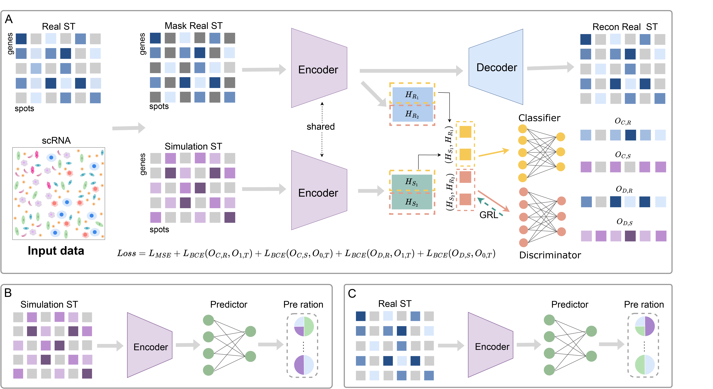

# MACD
In this study, we propose a masked adversarial neural network for cell type deconvolution (MACD) in spatial transcriptomics data.
First, we generate simulated data using scRNA-seq and spatial transcriptomics data from the same tissue. Then, we input the simulated data and real spatial transcriptomics data into an encoder for dimensionality reduction, performing adversarial learning in the low-dimensional space to capture common features. Subsequently, we use the simulated data to conduct supervised learning on the predictor. Finally, we apply the trained model to infer the cell type proportions in real spatial transcriptomics data.

## System environment
To run `MACD`, you need to install [PyTorch](https://pytorch.org) with GPU support first. The environment supporting MACD and baseline models is specified in the `requirements.txt` file.

## Datasets
The publicly available  datasets were used in this study. You can download them from https://zenodo.org/records/12804822 or find them on the following websites：
-  The Simulated_Datasets  contains 32 simulated datasets derived from samples of seven different organ tissues, including the heart, lung, liver, pancreas, trachea, brain, and kidney, from both humans and mice. The datasets are available in a GitHub repository at https://github.com/QuKunLab/SpatialBenchmarking.
-  murine lymph nodes：The spatial transcriptomics data includes 1,092 spots, and the single-cell sequencing data consists of 14,989 cells, with 15 different cell types identified.The datasets are available in https://github.com/romain-lopez/DestVI-reproducibility
- human developing heart：The ST data includes 210 spots, and the single-cell sequencing data comprises 3,777 cells, with 15 different cell types identified.The datasets are available in https://zenodo.org/record/4706209#.YIDBoalKjv5

## Run MACD and other Baselines models
After configuring the environment, download dataset4 from the Simulated_datasets in the data repository and place it into the Simulated_datasets folder. Then, Run `main.py`to start the process.If you want to run other data, simply modify the file path.

## Cite
Lin Huang†, Xiaofei Liu† and Wenwen Min†*. Masked adversarial neural network for cell type deconvolution in spatial transcriptomics (2024)

## Contact
mangoeshl12@gmail.com

minwenwen@ynu.edu.cn
