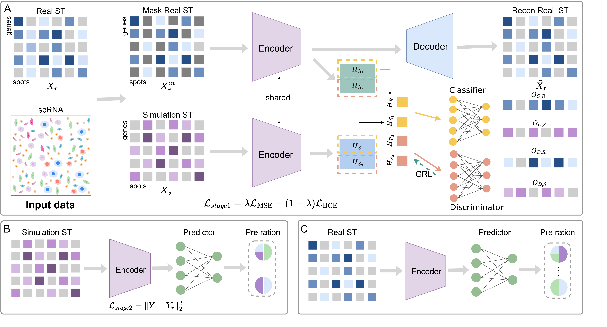

# MACD
In this study, we propose a masked adversarial neural network for cell type deconvolution (MACD) in spatial transcriptomics data.
First, we generate simulated data using scRNA-seq and spatial transcriptomics data from the same tissue. Then, we input the simulated data and real spatial transcriptomics data into an encoder for dimensionality reduction, performing adversarial learning in the low-dimensional space to capture common features. Subsequently, we use the simulated data to conduct supervised learning on the predictor. Finally, we apply the trained model to infer the cell type proportions in real spatial transcriptomics data.

## System environment
Required package:
- PyTorch >= 2.2.0
- scanpy >= 1.8
- python >=3.10

## Datasets

## Run MACD and other Baselines models
After configuring the environment, download dataset4 from the Simulated_datasets in the data repository and place it into the Simulated_datasets folder. Then, Run `main.py`to start the process.
